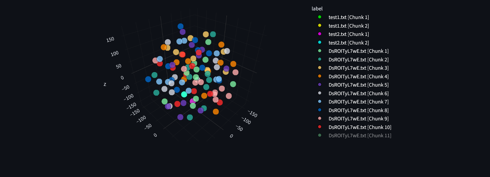

## Doc-Vector


A simple document chunking and visualization tool. Upload `.txt` files, explore TF‑IDF vectors in an interactive 3D t‑SNE plot, and query for the most similar chunks. Includes a tiny CLI demo for vector-based matching.

### Features
- Upload multiple `.txt` files; content is split into overlapping chunks
- TF‑IDF vectorization with English stopword filtering
- 3D t‑SNE visualization in-browser (Plotly via Streamlit)
- Query to find top‑k similar chunks with cosine similarity
- Table preview of all chunks

### Project structure
```
Doc-Vector/
  app.py                    # CLI demo using a simple VectorCompare interface
  main/
    vizualizer_app.py       # Streamlit 3D vector visualizer
  docs/                     # Example documents (PDF not used by app directly)
  pyproject.toml            # Python deps (PEP 621)
  uv.lock                   # uv lockfile (optional)
```

### Requirements
- Python 3.13+
- Windows, macOS, or Linux

Deps are declared in `pyproject.toml` (Streamlit, scikit‑learn, Plotly, NumPy, Matplotlib, PyPDF2, python-docx).

### Setup

Option A — using uv (recommended):
```powershell
# in project root
uv venv
uv sync

# activate (PowerShell)
. .\.venv\Scripts\Activate.ps1
```

Option B — using pip:
```powershell
python -m venv .venv
. .\.venv\Scripts\Activate.ps1

# install core runtime deps
pip install streamlit scikit-learn plotly numpy matplotlib pypdf2 python-docx
```

### Run the visualizer (Streamlit)
```powershell
streamlit run main/vizualizer_app.py
```

Then:
- Use “Upload documents” to add one or more `.txt` files
- Optionally enter a query to see the top similar chunks and highlight the query point in the 3D plot
- Scroll down to browse the chunk table

Notes:
- Large files: t‑SNE is computationally expensive; start with a few files or reduce chunk size/overlap in `chunk_text` if needed
- Mobile screens: use desktop for best Plotly 3D interaction

### CLI demo
There is a small CLI example in `app.py` that demonstrates searching across a tiny in‑memory corpus.

Run it:
```powershell
python app.py
```
Enter a search term when prompted to see similarity scores and snippet matches.

### Troubleshooting
- If Plotly shows a deprecation warning or logo: the app sets `config` to hide the logo and enable responsiveness
- If you cannot run Streamlit: verify the virtual environment is activated and packages are installed
- If Python 3.13 isn’t available on your system: use the latest Python 3.12 and adjust `requires-python` locally

### License
MIT (add a LICENSE file if distributing)


